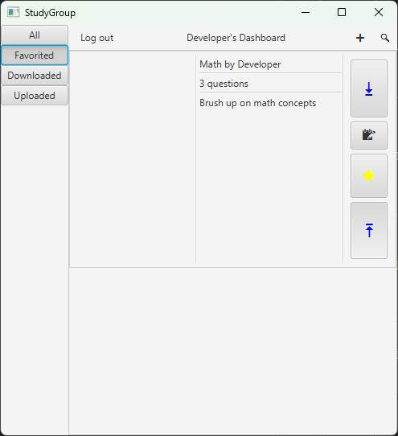
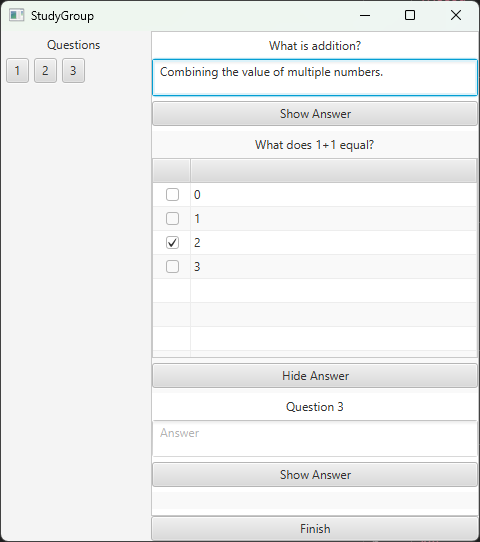
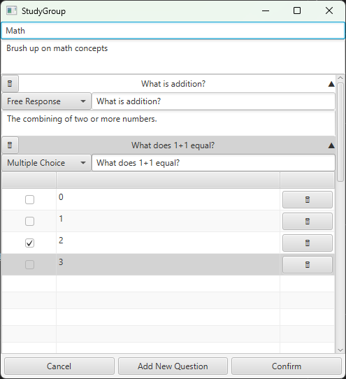
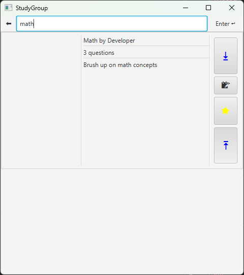

# StudyGroup


StudyGroup is a JavaFX desktop application with a Node.js backend for managing study guides. Users can create, browse, save, favorite, download, upload, and edit study guides, while the backend handles authentication, search, and persistence through T-SQL-backed storage.

## Table of Contents

- [Screenshots](#screenshots)
- [Features](#features)
- [Using the Application](#using-the-application)
- [For Developers](#for-developers)
  - [Requirements](#requirements)
  - [Technology Stack](#technology-stack)
  - [Project Overview](#project-overview)
  - [Repository Structure](#repository-structure)
  - [Configuration](#configuration)
  - [Quick Start](#quick-start)
- [Feedback & Support](#feedback--support)
- [License](#license)

## Screenshots

### Home Page



### Study Guide Viewer



### Study Guide Editor



### Search



Recommended screenshots:

- **Home/Browse Page** – The main screen users see after launching the application.
- **Study Guide Editor** – Creating or editing a study guide.
- **Study Guide Viewer** – Viewing questions and answer choices.
- **Search Results** – Demonstrating the search functionality.
- **Login/Guest Screen** _(optional)_ – Showing the authentication options.

## Features

- Create and edit study guides
- Browse study guides and their questions
- Search for study guides
- Save, favorite, and download study guides
- Upload study guides to the server
- Continue as a guest or sign in with an account

## Using the Application

If you only want to use StudyGroup and do not plan to modify the source code:

1. Download the latest release from the project's [Releases](https://github.com/Kirya-D/StudyGroup/releases) page.
2. Extract the downloaded archive (if applicable).
3. Launch the packaged frontend application.
4. If the release includes an installer or launcher, use that instead of building the project from source.

> The frontend connects to a hosted backend, so no backend setup is required to use the application.

## For Developers

This repository contains both the frontend application and the backend source code.

### Requirements

- **Operating System:** Windows
- **Java:** Java 26
- **JavaFX:** 25.0.3
- **Build Tools:** Maven and npm

### Technology Stack

| Component   | Technology             |
| :---------- | :--------------------- |
| Frontend    | Java 26, JavaFX 25.0.3 |
| Backend     | Node.js                |
| Database    | T-SQL                  |
| Build Tools | Maven, npm             |

### Project Overview

The repository is organized into two main components:

- `frontend/` — JavaFX desktop client
- `backend/` — Node.js server and T-SQL database access layer

The frontend communicates with the backend over HTTP, while the backend handles authentication, search, and data persistence.

### Repository Structure

```text
backend/
├── src/
│   ├── main/
│   │   ├── model/               Database models and application data
│   │   ├── request_handlers/    API request handlers
│   │   └── utils/               Shared backend utilities
│   └── test/                    Backend tests

frontend/
├── src/
│   ├── main/
│   │   ├── java/                Java source code
│   │   └── resources/           FXML, images, stylesheets, and other resources
│   └── test/                    Frontend tests
```

### Configuration

Both the frontend and backend use environment variables for configuration.

Before running the project locally:

1. Copy each `.env.example` file to a `.env` file in its respective directory.
2. Update the environment variables as needed for your local setup.
3. Start the backend before launching the frontend.

### Quick Start

1. Clone the repository.

2. Copy the provided `.env.example` files to `.env` in both the `frontend` and `backend` directories.

3. Install backend dependencies:

   ```bash
   npm install
   ```

4. Configure both `.env` files for your local environment.

5. Start the backend.

6. Build and run the frontend using Maven.

## Feedback & Support

If you encounter a bug, have a feature request, or want to suggest an improvement:

1. Check the project's [Issues](https://github.com/Kirya-D/StudyGroup/issues) page to see if the problem has already been reported.
2. If it has not been reported, create a new issue with:
   - A clear description of the problem or suggestion
   - Steps to reproduce the issue (if applicable)
   - Screenshots or error messages when helpful

Providing detailed feedback helps improve StudyGroup and makes it easier to address issues.

## License

This project is licensed under the GNU General Public License v3.0 (GPLv3).

For more information, see the [GPLv3 License](https://www.gnu.org/licenses/gpl-3.0.html).
